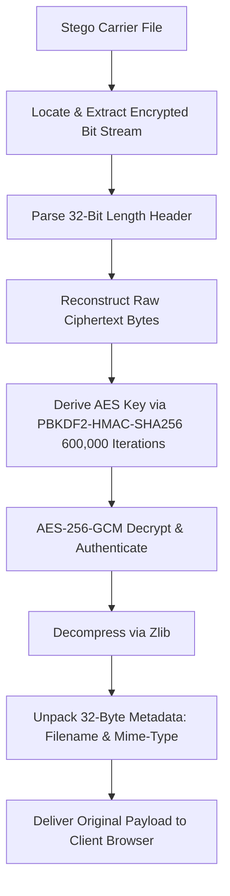

# 🔒 OpaquePixel: Project Description & Technical Documentation

**OpaquePixel** is an advanced, enterprise-grade multi-carrier steganography and digital forensics security platform. It provides a secure environment for embedding, extracting, and auditing encrypted data hidden within digital media carriers (Images, Audio, Video, and Documents). Originally engineered as a final project for an IBM Cyber Security Internship, the platform showcases professional-grade security workflows, zero-knowledge air-gapped authentication concepts, and a modern Liquid Glass UI inspired by macOS Tahoe.

---

## 🏗️ System Architecture & Workflow

OpaquePixel coordinates a modern, high-performance web architecture split into a React-based single-page application frontend and a FastAPI (Python) backend engine.

### 1. Steganographic Hiding Pipeline
```mermaid
flowchart TD
    A[Raw Payload (Text/File)] --> B[Serialize with Metadata Header]
    B --> C[Compress via Zlib Level 6]
    C --> D[Derive AES Key via PBKDF2-HMAC-SHA256 <br> 600,000 Iterations]
    D --> E[Encrypt via AES-256-GCM]
    E --> F[Prepend 32-Bit Length Header to Bit Stream]
    F --> G[Vectorized Injection into Carrier Channel]
    G --> H[Stream Output Stego Carrier to Client]
```

### 2. Forensic Extraction (Reveal) Pipeline


---

## 🛠️ Technology Stack

| Layer | Technologies & Libraries |
| :--- | :--- |
| **Frontend UI Core** | React 18, Vite, Tailwind CSS, JavaScript (ESNext) |
| **Icons & Utilities** | Lucide Icons, Axios (HTTP Client), JSZip, CSS Variables Theme Switcher |
| **Report Generation** | Native browser print-to-PDF template subsystem |
| **Backend Core API** | Python 3.14, FastAPI, Uvicorn |
| **Computer Vision / DSP** | OpenCV (`cv2`), NumPy, Scipy |
| **Cryptographic Primitive**| PyCryptodome (via Python `cryptography` package) |

---

## 📁 Repository Structure Directory Tree

An overview of the repository directories and the responsibilities of key files:

```
Opaquepixel-main/
├── .github/                       # GitHub Actions workflows & configuration
├── .idea/                         # IDE workspaces files
├── docs/
│   └── Opaque_Pixel_Software_Doc.pdf  # Design manual & documentation
├── scripts/
│   ├── generate_pptx.py           # Presentation slides generator script
│   └── generate_submission_pdf.py # Project report PDF generator
├── pixelvault-backend/            # Python FastAPI backend service
│   ├── assets/                    # Static resources (e.g. generated Auth QR code)
│   ├── config.py                  # API limits, MIME types, and constants configuration
│   ├── main.py                    # FastAPI entrypoint, middleware, and routers mounting
│   ├── requirements.txt           # Python application package dependencies
│   ├── engines/                   # Low-level cryptography & embedding engines
│   │   ├── __init__.py
│   │   ├── audio_stego.py         # Append-based audio carrier payload injection
│   │   ├── crypto.py              # PBKDF2 + AES-256-GCM symmetric crypto implementation
│   │   ├── document_stego.py      # PDF appending / ZIP insertion for document carriers
│   │   ├── f5_stego.py            # F5 matrix DCT frequency-domain steganography
│   │   ├── image_stego.py         # DST (Discrete Cosine/Spectral Transform) QIM steganography
│   │   ├── lsb_image_stego.py     # NumPy spatial LSB bitmap substitution engine
│   │   ├── matrix_stego.py        # Hamming (7,4) syndrome code steganography
│   │   ├── payload.py             # Packaging headers, compression, and bit conversion utilities
│   │   ├── pvd_stego.py           # Pixel Value Differencing steganography
│   │   ├── spatial_stego.py       # Spatial green/blue channel LSB steganography
│   │   └── video_stego.py         # Multi-frame keyframe video steganography
│   ├── routers/                   # API endpoint handlers
│   │   ├── __init__.py
│   │   ├── auth.py                # QR-code parsing authentication handler
│   │   ├── hide.py                # Payload hiding service endpoint router
│   │   ├── reveal.py              # Payload revealing/decryption service endpoint router
│   │   └── scan.py                # Forensic inspection steganalysis scanning endpoint router
│   ├── scripts/
│   │   └── generate_auth_qr.py    # Zero-knowledge bypass QR-code generator script
│   ├── tests/                     # Backend unit tests using pytest
│   │   ├── test_audio_stego.py
│   │   ├── test_auth.py
│   │   ├── test_core.py
│   │   └── test_document_stego.py
│   └── utils/                     # Backend auxiliary utilities
│       ├── auth.py                # Authentication verification and token helpers
│       ├── cleanup.py             # Temporary files & directory cleanups
│       ├── rate_limit.py          # Failed attempt tracking & limits
│       └── validators.py          # Password complexity rules & extension check validators
├── pixelvault-frontend/           # React single-page app
│   ├── postcss.config.js          # PostCSS processor configuration
│   ├── tailwind.config.js         # Custom palette, layout, and animation styles config
│   ├── vite.config.js             # Vite building pipeline and proxy configuration
│   ├── index.html                 # Main HTML index template
│   ├── src/                       # Frontend source directory
│   │   ├── App.jsx                # React App router routes registration
│   │   ├── index.css              # Custom themes, liquid glass effects, and animations
│   │   ├── main.jsx               # React DOM rendering engine mount
│   │   ├── api/
│   │   │   └── opaquepixel.js     # Axios API layer connecting to the backend
│   │   ├── components/            # Reusable UI widgets
│   │   │   ├── layout/            # Layout wraps (AppShell, Header, Footer)
│   │   │   ├── ui/                # Decorative elements (FormatOrbs, Marquee, PageHero)
│   │   │   ├── AlgorithmSelector.jsx
│   │   │   ├── AmbientBackground.jsx
│   │   │   ├── AuthScanZone.jsx
│   │   │   ├── CapacityBar.jsx
│   │   │   ├── CarrierTypeSelector.jsx
│   │   │   ├── CursorGlow.jsx
│   │   │   ├── DropZone.jsx
│   │   │   ├── FormatBadge.jsx
│   │   │   ├── GlassCard.jsx
│   │   │   ├── HideEncryptStep.jsx
│   │   │   ├── Logo.jsx
│   │   │   ├── ModeSelector.jsx
│   │   │   ├── PasswordField.jsx
│   │   │   ├── ProtectedRoute.jsx
│   │   │   ├── ResultCard.jsx
│   │   │   ├── Toast.jsx
│   │   │   └── WhatsAppCompressionNotice.jsx
│   │   ├── pages/                 # Full view application pages
│   │   │   ├── ContactPage.jsx    # Developer contact and email interface
│   │   │   ├── HidePage.jsx       # Hide workflow interface
│   │   │   ├── HowItWorksPage.jsx # Platform details, developer banner, & algorithm explanations
│   │   │   ├── InfoPage.jsx       # Main landing page with lead creator info
│   │   │   ├── RevealPage.jsx     # Reveal workflow interface
│   │   │   └── ScanPage.jsx       # Steganalysis audit suite interface
│   │   └── utils/                 # Frontend helpers
│   │       ├── auth.js            # JWT session token management helpers
│   │       ├── formatSize.js      # Byte size formatting helper
│   │       ├── mimeTypes.js       # MIME identification & payload capacity estimators
│   │       ├── passwordValidator.js# Password regex pattern checker
│   │       ├── pdfReport.js       # Printable HTML window-based PDF forensic report renderer
│   │       └── theme.js           # Theme class applier (green vs. bw)
└── ecosystem.config.js            # PM2 deploy configurations
```

---

## 🔒 Cryptography & Packaging Deep-Dive

Before any bit is hidden in a carrier, OpaquePixel enforces a high-security packaging standard to guarantee **confidentiality**, **integrity**, and **metadata preservation**:

1. **Header Packaging**:
   - The original filename (truncated to 16 bytes) and MIME-type (truncated to 16 bytes) are packed into a 32-byte header block.
   - The header is prepended to the raw payload bytes: `[Header (32B)] + [Payload (NB)]`.
2. **Compression**:
   - The packaged sequence is compressed using `zlib` (level 6 deflation) to minimize size, maximize transmission efficiency, and reduce the steganographic footprint within the carrier.
3. **Key Derivation (PBKDF2)**:
   - A user-provided password and a random 16-byte cryptographic salt are fed into **PBKDF2-HMAC-SHA256** with **600,000 iterations** to derive a 32-byte symmetric key.
4. **Authenticated Encryption (AES-256-GCM)**:
   - The compressed block is encrypted using **AES-256-GCM** with a random 12-byte initialization vector (nonce).
   - This returns an authenticated ciphertext payload: `[Salt (16B)] + [Nonce (12B)] + [Ciphertext + Auth Tag]`.
5. **Bit Stream Construction**:
   - The encrypted sequence is converted into a binary bit-plane array.
   - A 32-bit big-endian length prefix containing the length of the payload bit stream is prepended to the stream, ensuring exact extraction boundaries.

---

## ⚙️ Steganography Embedding Engines

### 1. Spatial Domain engines (Image Carriers)
- **Least Significant Bit (LSB)** (`lsb_image_stego.py`):
  - Directly overwrites the least significant bits of all subpixels (RGB) in the spatial domain using optimized NumPy masks.
- **Spatial (Green/Blue)** (`spatial_stego.py`):
  - Restricts LSB modification specifically to the Green and Blue color channels, leaving Red untouched to minimize visual distortion in human eye response.
- **Pixel Value Differencing (PVD)** (`pvd_stego.py`):
  - Evaluates adjacent subpixel pairs ($P_1, P_2$) to calculate their difference. It adaptively embeds bits by adjusting the parity of the differences while keeping visual boundaries sharp.

### 2. Frequency Domain engines (Image & Video Carriers)
- **Discrete Spectral Transform (DST/DCT)** (`image_stego.py`):
  - Converts the BGR carrier into the YCbCr color space.
  - Partitions the Y (luminance) channel into 8x8 pixel blocks.
  - Applies a Discrete Cosine Transform (DCT) to each block.
  - Embeds payload bits into 16 selected mid-frequency AC coefficients using **Quantization Index Modulation (QIM)** (with a step size $\Delta = 25.0$).
  - Performs an Inverse DCT (IDCT) and converts back to BGR. This preserves steganographic resilience under mild image compressions.
- **F5 Matrix DCT** (`f5_stego.py`):
  - Similar to the DST engine, it targets 8x8 luminance DCT coefficients. However, it incorporates F5 matrix permutations and QIM ($\Delta = 28.0$) to modify the coefficients with minimal disturbance, mitigating statistical steganalysis.
- **Matrix Hamming (7,4)** (`matrix_stego.py`):
  - Implements syndrome coding steganography based on a $(7,4)$ Hamming code parity matrix.
  - Embeds 3 payload bits into groups of 7 subpixel LSBs by altering at most 1 LSB per group, significantly reducing the bit-flip rate and preserving visual fidelity.

### 3. Video Steganography Engine (`video_stego.py`)
- Reads the input MP4 carrier frame-by-frame.
- Encodes an index map of selected frame offsets (defaulting to every 5th frame).
- Embeds the index map and payload bits into the chosen frames using the frequency-domain DST engine.
- Re-encodes the output video using an `ffmpeg` sub-process configured with **libx264** at a constant rate factor (**CRF 18**) and **ultrafast** preset to output an optimized, highly compatible h.264 stream.

### 4. Audio Steganography Engine (`audio_stego.py`)
- Uses append-based steganography.
- Appends the payload block at the end of the raw audio bytes stream (e.g., MP3, WAV, FLAC), marked with a MAGIC boundary identifier (`b"PXVLT\x01"`) and a 4-byte big-endian length prefix.

### 5. Document Steganography Engine (`document_stego.py`)
- **ZIP-based documents** (`.docx`, `.pptx`, `.xlsx`, `.odt`, `.ods`, `.odp`, `.odg`):
  - Reads the file structure as a ZIP archive.
  - Injects a compressed and encrypted payload file directly into the internal zip tree at the path `_pixelvault/stego.dat`, leaving existing document files unchanged.
- **Append-based documents** (`.pdf`, `.rtf`, `.txt`, `.csv`, `.md`, `.html`, `.htm`, `.xml`):
  - For PDF files, searches for the final `%%EOF` marker and appends the payload block directly after it to prevent document corruption.
  - For plain text and RTF structures, appends the payload to the end of the binary stream.

---

## 🔍 Forensic Steganalysis & Scanning Suite

The platform's Deep Forensic Scan (`scan.py`) conducts multi-stage investigations on files to detect potential hidden payloads.

### 1. Structural Boundaries Check
- Scans container formats for trailing data appended beyond standard terminations, such as the JPEG End-Of-Image marker (`\xff\xd9`) or PNG `IEND` chunk.

### 2. Chi-Square ($\chi^2$) LSB Audit
- Implements a spatial steganography detection algorithm.
- Extracts subpixels and computes a histogram of Value Pairs (POVs) (e.g., frequencies of even value $2k$ vs. odd value $2k+1$).
- Calculates the $\chi^2$ anomaly statistic:
  $$\chi^2 = \sum \frac{(N_{even} - N_{expected})^2}{N_{expected}}$$
- If the difference is abnormally low (signified by a normalized ratio $< 0.85$), the pixel distribution is flagged as artificially randomized.

### 3. Shannon Entropy Scan
- Measures byte/bit sequence complexity. High-entropy structures ($> 7.35$) in quiet or structured parts of files indicate compression or encryption associated with hidden payloads.

### 4. Edge Variance Analysis
- Audits variance profiles of adjacent pixel difference vectors to detect local spikes in noise levels that typically coincide with PVD embedding.

---

## 🎨 Dual-Theme Design Engine

The frontend is styled in a glassmorphic aesthetic using pure Tailwind CSS and custom stylesheets. It supports two primary visual environments toggled via a header utility button:

1. **Dark Emerald Cyber Mode (`green`)**:
   - Features rich, bioluminescent dark green gradients, glowing glassmorphism, transparent backdrops, and blur effects (`backdrop-blur-3xl`).
2. **Monochrome White Mode (`bw`)**:
   - Inspired by sleek Dribbble SaaS layouts, it applies high-contrast black & white styling, sharp borders, and stark elements.

---

## 🚀 Setup & Run Instructions

### Prerequisites
* **Node.js**: Version `20.x` or higher
* **Python**: Version `3.10` or higher
* **FFmpeg**: Configured in system path (required for video steganography re-encoding)

### 1. Backend Server Setup
```bash
# Navigate to the backend directory
cd pixelvault-backend

# Initialize a Python virtual environment
python -m venv .venv

# Activate the virtual environment
# On Windows (PowerShell):
.venv\Scripts\Activate.ps1
# On Linux/macOS:
source .venv/bin/activate

# Install requirements
pip install -r requirements.txt

# Start the FastAPI server using Uvicorn
uvicorn main:app --reload --port 8000
```
*The API docs will be active at: `http://localhost:8000/docs`.*

### 2. Frontend Server Setup
```bash
# Navigate to the frontend directory
cd pixelvault-frontend

# Install node dependencies
npm install

# Start the Vite local development server
npm run dev
```
*The React client will be active at: `http://localhost:5173`.*
