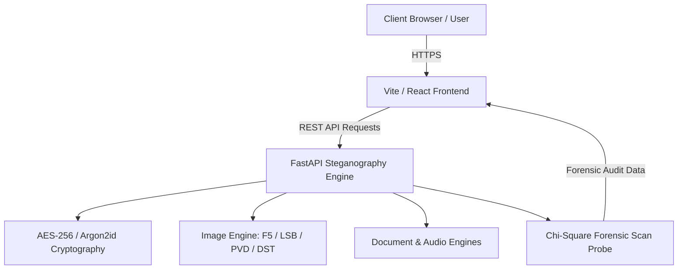

<div align="center">

  <h1>🔒 OpaquePixel</h1>
  <p><strong>Next-Generation Multi-Algorithm Steganography & Forensic Security Platform</strong></p>

  <p>
    <a href="https://opaquepixel.app"><strong>Explore Live Platform (opaquepixel.app) »</strong></a>
  </p>

  <p>
    
    
    
    
  </p>

</div>

---

## 📖 Overview

**OpaquePixel** is an advanced, enterprise-grade steganography and digital forensics workspace designed to embed, extract, and audit hidden encrypted payloads within multimedia carriers (Images, Audio, Video, and Documents). Built with a state-of-the-art **macOS Tahoe Liquid Glass** visual interface and a high-performance **FastAPI** cryptography engine, OpaquePixel offers military-grade privacy for ethical security research and lawful data protection.

---

## ✨ Core Features

* 🛡️ **Multi-Algorithm Steganography Pipeline**:
  * **F5 Matrix Encoding**: Non-zero DCT coefficient permutation embedding resistant to statistical steganalysis.
  * **DST (Discrete Cosine Transform)**: Frequency domain spectral embedding engineered for compression resilience.
  * **LSB (Least Significant Bit)**: High-capacity spatial domain embedding for lossless PNG carriers.
  * **PVD (Pixel Value Differencing)**: Edge-adaptive pixel pair variance embedding.
  * **Document & Audio Steganography**: Hidden payload channels inside PDF structural streams and WAV audio carrier frequencies.
* 🔍 **Deep Forensic Scan & Inspection Engine**:
  * Multi-stage automated steganalysis auditing carrier binary entropy, Chi-Square ($\chi^2$) bit-plane distributions, and high-frequency coefficient perturbations.
  * Generates downloadable, printable **PDF Forensic Audit Reports**.
* 🎨 **Dual Design System & Theme Engine**:
  * **Dark Emerald Cyber Mode**: Deep bioluminescent gradients and glowing glassmorphism.
  * **Monochrome White Mode**: Crisp, high-contrast black & white SaaS aesthetic inspired by Dribbble designs.
* 🔑 **Zero-Knowledge QR Authentication**:
  * Air-gapped HMAC-SHA256 signed QR key pair authentication eliminating traditional passwords.

---

## 🛠️ Technology Stack

| Layer | Technologies |
| :--- | :--- |
| **Frontend UI** | React 18, Vite, Tailwind CSS, JavaScript (ESNext), Lucide Icons |
| **Backend API** | Python 3.14, FastAPI, OpenCV (cv2), NumPy, PyCryptodome, PyPDF2 |
| **Deployment** | GitHub Pages (Frontend), Render / Cloud Web Services (FastAPI Backend) |

---

## 🏗️ System Architecture



---

## 🚀 Quick Start (Local Development)

### Prerequisites
* **Node.js**: `v20.x` or higher
* **Python**: `v3.10` or higher

### 1. Backend Setup
```bash
# Navigate to backend directory
cd pixelvault-backend

# Create virtual environment
python -m venv .venv
source .venv/bin/activate  # On Windows: .venv\Scripts\activate

# Install dependencies
pip install -r requirements.txt

# Launch FastAPI development server
uvicorn main:app --reload --port 8000
```

### 2. Frontend Setup
```bash
# Navigate to frontend directory
cd pixelvault-frontend

# Install dependencies
npm install

# Launch Vite development server
npm run dev
```
Open `http://localhost:5173` in your web browser.

---

## 📄 License & Ethical Disclaimer

This project is licensed under the **MIT License**. 

> **Disclaimer**: OpaquePixel is designed strictly for lawful privacy protection, security research, and educational digital forensics. The creators assume no liability for misuse. Always adhere to local compliance regulations regarding encryption and steganography usage.

---

<div align="center">
  <sub>Designed & Developed with ❤️ for lawful privacy & digital security.</sub>
</div>
